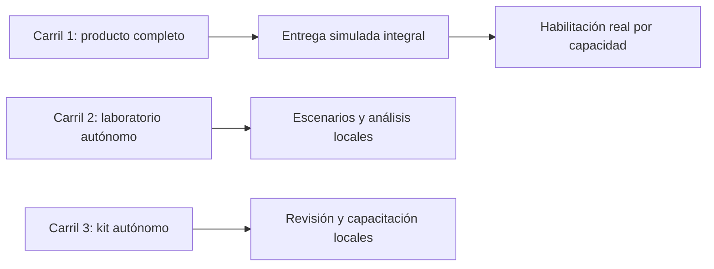

# Pasanaku — Carril 1 principal: plan integral de producto, dinero y operación

**Fecha:** 8 de octubre de 2026. **País y moneda:** Bolivia, BOB. **Estado:** planificación; implementación pendiente. **Prioridad:** principal. **Dependencias de los carriles 2 y 3:** ninguna.

Este documento es autosuficiente y contiene el trabajo obligatorio para completar el producto solicitado. Los otros dos carriles son accesorios: se pueden cancelar, ejecutar después o no ejecutar sin impedir la terminación de este carril. Los tres documentos son planes, no constancias de implementación, autorización financiera ni pruebas ejecutadas.

## 1. Resultado que debe producir este carril

Entregar un recorrido funcional, persistente, auditable y probado desde la solicitud de habilitación de un administrador hasta el cierre de un grupo, incluyendo pagos, invitaciones, admisión humana, recomendación de riesgo, sorteo, compraventa del derecho al turno, entrega del pozo completo, retiros, inversiones voluntarias, rescates, QR y cargos. El recorrido debe funcionar primero con proveedores simulados y servicios de dominio reales. La salida con dinero real tendrá una habilitación separada por capacidad y evidencia.

Se incluyen aquí el mock server, su cableado, la contabilidad, la auditoría productiva, los controles de seguridad, el algoritmo mínimo explicable, la conciliación, las interfaces y todas las pruebas esenciales. Ninguna de estas responsabilidades se delega a un carril accesorio.

### 1.1 Reglas confirmadas por el dueño del producto

1. El backoffice aprueba o rechaza la habilitación de una persona para actuar como administrador.
2. Una persona habilitada crea un grupo y queda como administrador de ese grupo en la misma operación lógica.
3. No se agrega una segunda aprobación humana del grupo por interpretación de la solicitud original. La activación sí necesita controles de cupo, calendario, contratos y cobertura.
4. El administrador propone aceptar o rechazar a un candidato. El backoffice avala o modifica esa decisión y conserva la autoridad final sobre la admisión.
5. El algoritmo recomienda y explica. No activa membresías, no sanciona y no sustituye al backoffice.
6. Cada invitación genera un token único, de uso controlado y asociado a su grupo.
7. Recibir mesa significa recibir el pozo completo del turno. La empresa aporta el faltante.
8. Deben evaluarse las inversiones voluntarias y el dinero temporalmente disponible de los grupos.
9. Toda la operación se diseña para Bolivia y bolivianos.

### 1.2 Recomendaciones de diseño que necesitan decisión comercial antes de dinero real

| Tema | Recomendación para construir y simular | Condición antes de ofrecerlo realmente |
| --- | --- | --- |
| Respaldo del pozo | Compromiso empresarial financiado y reservado antes de activar el grupo | Contrato, naturaleza jurídica, capital y liquidez disponibles |
| Comisión por servicio | Cobro separado del principal del pozo | Tarifa, impuestos, consentimiento y tratamiento de incumplimiento de esa tarifa |
| Inversión voluntaria | Producto contratado con banco o SAFI autorizado | Alianza, facultades propias, titularidad y proceso de distribución |
| Dinero de grupos | Mantenerlo disponible; inversión desactivada inicialmente | Dictamen, consentimiento válido, derechos sobre intereses y prueba de liquidez |
| Venta del turno | Cesión de un derecho de cobro; vendedor conserva aportes pendientes | Validez y límites de la cesión, elegibilidad, responsabilidad y contrato |
| Comisión sobre ganancias | Solo si existe base contractual y regulatoria; después de costos y pérdidas anteriores | Método, referencia, impuestos y facultad de cobrarla |
| Ganancias al organizador | No crear comisiones ni tránsito de dinero por el organizador | Cualquier cambio exige una decisión explícita frente a la regla RN18 existente |

Estos valores son supuestos de diseño reversibles para la simulación. No se presentan como decisiones comerciales ya aprobadas.

## 2. Estructura de los tres carriles e independencia

| Carril | Responsabilidad | Puede escribir en | Necesita otro carril para empezar o terminar |
| --- | --- | --- | --- |
| 1 — Principal | Producto completo y sus controles obligatorios | Repositorios productivos, después de inventario y elección del checkout | No |
| 2 — Secundario | Laboratorio financiero local con datos sintéticos | Proyecto autónomo `Pasanaku-Laboratorio-Financiero` | No |
| 3 — Secundario | Kit autónomo de revisión de evidencias y capacitación | Proyecto autónomo `Pasanaku-Kit-Evidencias` | No |

Reglas de independencia:

- Este carril no importa bibliotecas, archivos, contratos, parámetros ni resultados de los secundarios.
- Sus pruebas y pipeline no ejecutan los secundarios. Su definición de terminado no menciona entregables secundarios como requisito.
- Los secundarios no editan esquemas, APIs, librerías, locks, CI, configuración ni documentación controlada por este carril.
- Cada secundario lleva sus fixtures sintéticos y su propia forma de ejecución. No necesita levantar Pasanaku.
- Si una investigación accesoria resulta útil, su adopción será un cambio nuevo, revisado y probado por el principal. No se añade un paso obligatorio de integración al cierre.
- Independencia técnica no elimina las dependencias legítimas de este carril respecto de autorizaciones, proveedores, financiación y decisiones humanas para operar dinero real.



No hay flechas entre carriles porque no existe dependencia de ejecución, compilación, datos ni aceptación.

## 3. Base técnica revisada y límites de lo conocido

La revisión de planificación identificó:

- `PasanakuBackend`: Java/Gradle, PostgreSQL, jOOQ y servicios `identidad`, `organizador`, `grupos`, `aportes`, `garantia`, `entregas`, `nucleo-financiero`, `auditoria`, `cumplimiento`, `tarifas`, `erp`, `transparencia`, `notificaciones` y `publicidad`.
- `PasanakuFrontend`: Angular para web/backoffice y Flutter para móvil; workspaces Yarn; clientes derivados de contratos.
- `packages/simulado`: mock existente basado en Prism y ejemplos OpenAPI. Sirve para contratos; por sí solo no demuestra el ciclo persistente completo.
- Backend con tareas agregadas `verificar`, `integrationTest`, `contractTest`, `sagaTest`, `e2eTest`, `generateJooq` y `generateOpenApiClients`.
- Frontend con scripts `dev:mock`, `dev:movil`, `dev:backoffice`, `dev:web`, `lint`, `typecheck`, `test:front`, `test:a11y`, `build` y `humo:recorrido`.
- El script actual `humo` contiene `|| true`. No puede usarse como puerta de aceptación que falle ante errores. Corregir el comportamiento dentro del alcance o utilizar un runner que propague fallos.
- Hay varios checkouts y cambios locales en el frontend, incluidas capturas y documentación. Preservarlos; elegir base y registrar estado antes de desarrollar. No usar un reset global ni asumir que todas las carpetas contienen el mismo HEAD.

Esta lectura no certifica que cada módulo ya implemente correctamente el negocio. Cada microtarea empieza localizando el equivalente existente y registrando la brecha. No crear un segundo ledger, un segundo organizador o un catálogo de contratos paralelo por conveniencia.

### 3.1 Documentación que debe reconciliarse

| Evidencia existente | Tensión con la solicitud | Acción dentro del principal |
| --- | --- | --- |
| `docs/entidades/08_garantia_incumplimiento.md` | Fondo mutual/de miembros, límites y agotamiento | Separar ese mecanismo del compromiso corporativo solicitado |
| CU-23, cobertura de incumplimiento | Puede bloquear entrega cuando falta fondo | Financiar el compromiso antes de activar; mantener deuda de entrega e incidente si falla |
| CU-22, liquidación y entrega | Puede deducir cargos del pozo | Definir principal completo y cobro separado, o resolver formalmente bruto/neto |
| CU-20, creación de grupos | Posible excepción de autogestión | Alinear creación con habilitación previa del administrador |
| CU-90, organizadores | Base de onboarding y contrato | Reutilizar y ampliar su resolución humana y vigencia |
| CU-97, riesgo y alertas | Puede estar centrado en seguimiento | Extender a admisión y exposición sin convertirlo en autoridad final |
| CU-50 y billetera/custodia | Base de conciliación y respaldo | Completar conciliación de proveedor, banco y ledger |

Localizar las rutas exactas en el checkout elegido antes de editar; los nombres de CU aquí son referencias de inventario.

## 4. Modelo financiero recomendado

### 4.1 Separaciones necesarias

Mantener diferenciados titularidad, registro, disponibilidad y responsabilidades para:

1. Saldo de usuario disponible y retenido.
2. Aportes de cada grupo y turno.
3. Caja y reserva empresarial que respaldan los faltantes.
4. Posiciones voluntarias de inversión de cada titular.
5. Ingresos, gastos y obligaciones fiscales de la empresa.

Una separación de cuentas contables no demuestra por sí misma protección jurídica frente a insolvencia. El contrato y la custodia deben establecer a quién pertenece cada activo y quién tiene derecho a restitución. Tampoco basta una cuenta bancaria única con etiquetas internas sin análisis legal.

La garantía del pozo no garantiza la rentabilidad ni el principal de una inversión. Un DPF bancario y cuotas de un fondo administrado por SAFI tienen contratos, riesgos y registros diferentes. La plataforma no debe emitir un supuesto DPF propio por cambiar el nombre de una deuda.

### 4.2 Magnitudes mínimas de control

Para un grupo simple de `N` miembros, aporte `c` y un receptor por turno:

- Pozo por turno: `P = N × c`.
- Volumen completo del ciclo: `N × P = N² × c`.
- Exposición futura del receptor que cobra en el turno `k`, si aún debe sus aportes posteriores: `(N − k) × c`.
- Faltante de caja del turno: `max(0, P − aportes confirmados y utilizables para ese turno)`.
- La cobertura empresarial se reconoce por el faltante real y confirmado según corte; un aporte pendiente no es caja confirmada.
- La reserva de cobertura y los límites deben considerar todo el ciclo, correlaciones y otros grupos; no solo el próximo pago.
- Una recuperación futura reduce pérdida final si ocurre, pero no financia el pago de hoy.
- Capital para absorber pérdidas y liquidez para pagar a tiempo son controles distintos.

**Ejemplo sintético:** 12 personas, Bs 500, pozo Bs 6.000, volumen Bs 72.000. El primer receptor mantiene Bs 5.500 de aportes futuros. Al concluir seis entregas, la exposición futura de esos seis receptores es Bs 18.000. La suma de exposiciones medidas en el momento individual de cada cobro es Bs 33.000; es una magnitud diferente y no se suma a los Bs 18.000.

### 4.3 Política inicial de inversión de dinero de grupos

La función queda desactivada para dinero real. Sí se documenta y simula su comparación en este carril con un caso mínimo propio, sin utilizar el laboratorio secundario.

Ejemplo ilustrativo: Bs 600.000 disponibles al inicio de una ventana de siete días, tasa nominal hipotética de 4% anual y base 365 producen `600000 × 0,04 × 7 / 365 = Bs 460,27` antes de costos, impuestos y pérdidas. Es un supuesto favorable de cobro concentrado; no una oferta ni una previsión. La ganancia potencial se compara con el costo de demora, liquidación, custodia y cobertura. No se usa como fuente segura para financiar la garantía.

La habilitación futura requiere demostrar: titularidad, consentimiento, instrumentos permitidos, plazo, calendario de caja, concentración, rescate bajo estrés, atribución de rendimientos y pérdidas, impuestos y plan de continuidad. La fecha contractual de entrega no cambia por haber invertido el dinero.

## 5. Gobierno, permisos y decisiones humanas

### 5.1 Actores

| Actor | Facultades | Restricciones |
| --- | --- | --- |
| Participante | Solicitar, aportar, recibir, ofertar, comprar, retirar e invertir según habilitación | No actuar por otro titular ni modificar resoluciones |
| Administrador habilitado | Crear y gestionar sus grupos; proponer admisiones/rechazos | No aprobarse a sí mismo ni decidir por el backoffice |
| Analista de backoffice | Evaluar y preparar resolución con evidencia | Acceso por rol y ámbito; conflicto de interés declarado |
| Aprobador de backoffice | Resolver admisión y habilitación según competencia | No cambiar asientos ni omitir restricciones legales y de titularidad |
| Tesorería | Gestionar financiación, conciliación y contingencia | No aprobar sola sus propias excepciones materiales |
| Cumplimiento | Revisar restricciones, origen y reportes según normativa aplicable | No exponer al administrador información confidencial de monitoreo |
| Auditor | Consultar evidencia autorizada | Sin mutaciones de negocio |
| Operador técnico | Diagnosticar y ejecutar procedimientos autorizados | Sin botón genérico para acreditar dinero |

Recomendar doble control para pagos manuales extraordinarios, cambios de límites financieros, liberación excepcional de fondos y modificaciones de tarifas. Los umbrales reales son decisiones de gobierno pendientes, no constantes inventadas.

### 5.2 Resolución de admisión

1. El candidato solicita ingreso directamente o utiliza una invitación.
2. Se valida identidad, token si corresponde, vigencia del grupo y duplicidad.
3. El administrador registra propuesta y motivo.
4. El motor genera recomendación con datos disponibles, versión, razones y límites de confianza.
5. El backoffice recibe propuesta y recomendación como insumos diferenciados.
6. Una persona autorizada acepta, rechaza o pide más información. Puede apartarse del administrador o del algoritmo mediante motivo registrado.
7. La resolución se guarda antes de producir el efecto de membresía; ambos quedan correlacionados y recuperables.
8. Se notifica al usuario con lenguaje comprensible y un mecanismo de revisión. No revelar señales reservadas de fraude o datos de terceros.

Un vencimiento, un error del motor o una demora de backoffice nunca se convierte automáticamente en aceptación. Una decisión favorable puede quedar con efecto pendiente si falta una condición técnica o financiera; la interfaz debe distinguir resolución, ejecución y motivo. No se presenta al sistema como habiendo rechazado silenciosamente al miembro.

### 5.3 Auditoría mínima de cada decisión

Registrar `decisionId`, caso, grupo, candidato seudonimizado cuando corresponda, propuesta del administrador, recomendación, decisión final, identidad y rol efectivos del decisor, instante UTC, motivo estructurado y texto controlado, evidencia referenciada, versión de política, versión del agregado, correlación y efectos emitidos.

Las revisiones crean resoluciones nuevas vinculadas a la anterior. Proteger la cadena contra alteración con controles de acceso, almacenamiento de evidencia y anclajes verificables; un hash sin custodia de la referencia no garantiza integridad por sí solo. No registrar tokens, secretos, documentos completos o información personal innecesaria en logs.

## 6. Máquinas de estados propuestas

Los nombres siguientes son vocabulario de diseño. Reconciliarlos con los enums y contratos existentes antes de programar.

| Objeto | Transiciones principales | Regla de seguridad |
| --- | --- | --- |
| Habilitación administrador | BORRADOR → SOLICITADA → EN_REVISION → APROBADA / RECHAZADA; luego SUSPENDIDA / REVOCADA | Suspensión define gestión de grupos existentes y sustitución, sin apropiarse de sus fondos |
| Grupo | BORRADOR → EN_FORMACION → LISTO_PARA_ACTIVAR → ACTIVO → CERRANDO → CERRADO | Activación requiere roster, contratos, calendario y capacidad empresarial reservada |
| Invitación | EMITIDA → CONSUMIDA / VENCIDA / REVOCADA | Una invitación consumida no puede usarse de nuevo |
| Solicitud de ingreso | SOLICITADA → PROPUESTA_ADMIN → PENDIENTE_BO → ACEPTADA / RECHAZADA / REQUIERE_DATOS | La membresía activa requiere resolución humana favorable vigente |
| Sorteo | PREPARADO → COMPROMETIDO → EJECUTADO → PUBLICADO | Resultado único por versión de roster; no repetir por resultado inconveniente |
| Pago externo | CREADO → PENDIENTE → CONFIRMADO / RECHAZADO / DESCONOCIDO | DESCONOCIDO requiere consulta o conciliación; no reenvío ciego |
| Entrega | PROGRAMADA → FONDEANDO → LISTA → ENVIADA → CONFIRMADA | Sin confirmación de liquidación no se declara entregada |
| Oferta | BORRADOR → PUBLICADA → RESERVADA → LIQUIDANDO → VENDIDA | Cancelación y vencimiento compiten con compra mediante versión atómica |
| Cesión | CREADA → VALIDADA → FONDOS_RETENIDOS → TITULO_ASIGNADO → LIQUIDADA | Compensaciones según punto de irreversibilidad; no devolución ciega tras pago exitoso |
| Retiro | SOLICITADO → RETENIDO → ENVIADO → PAGADO / RECHAZADO / DESCONOCIDO | Saldo reservado no se gasta simultáneamente |
| Inversión | COTIZADA → CONSENTIDA → ORDENADA → PENDIENTE → CONFIRMADA / FALLIDA | Saldo enviado no permanece disponible y posición solo existe al confirmarse |
| Rescate | SOLICITADO → VALIDADO → PENDIENTE_PROVEEDOR → LIQUIDADO | Solicitar retiro no equivale a tener dinero disponible |

Cada transición necesita actor permitido, precondiciones, versión esperada, efecto contable, evento, idempotencia, expiración y compensación. Documentar además transiciones prohibidas y recuperación tras reinicio.

## 7. Cobertura exacta del pedido original

Se usa un identificador único porque el pedido repite el número 10.

| ID | Capacidad | Comportamiento exigido | Hito dueño |
| --- | --- | --- | --- |
| F01 | Solicitar ingreso | Solicitud individual con estado y revisión | H5 |
| F02 | Cargar saldo | Mock cableado; acreditación solo tras confirmación válida | H3–H4 |
| F03 | Solicitar ser administrador | Expediente y resolución humana | H5 |
| F04 | Aprobación por backoffice | Habilita administrador y resuelve admisión; bitácora íntegra | H5–H6 |
| F05 | Crear grupo | Creador habilitado queda administrador; activación financiera separada | H5–H7 |
| F06 | Recibir aceptación/rechazo | Token único de invitación y resultado notificable | H5 |
| F07 | Proponer aceptación/rechazo | Admin propone; backoffice decide | H5–H6 |
| F08 | Algoritmo de recomendación | Explicación, versión, SIN_DATOS y revisión humana | H6 |
| F09 | Sortear turnos | Roster congelado, evidencia y resultado único | H7 |
| F10 | Crear oferta con precio | Derecho válido, precio BOB, vencimiento y cargos | H9 |
| F11 | Vender turno | Cesión liquidada con responsabilidades explícitas | H9 |
| F12 | Ver ofertas | Solo ofertas elegibles, vigentes y no liquidadas | H9 |
| F13 | Comprar turno | Reserva atómica, pago y título sin doble venta | H9 |
| F14 | Recibir mesa | Pozo completo, cobertura empresarial y comprobante | H8 |
| F15 | Retirar saldo | Reserva, beneficiario validado y conciliación | H4 |
| F16 | Invertir voluntariamente | DPF o fondo real diferenciado; mock ambos | H10 |
| F17 | Solicitar rescate | Plazo, liquidación, restricciones y saldo confirmado | H10 |
| F18 | Transferir por QR | Destinatario verificable, consentimiento y confirmación | H4 |
| F19 | Cobrar comisión | Tarifa versionada, desglose, impuestos y reversos | H11 |
| F20 | Pagar intereses | Devengo y cobro real separados; fuente contractual | H10–H11 |
| F21 | Cobrar regalía de rentabilidades | Comisión sobre resultado elegible, sin cobrar aportes como ganancia | H11 |

## 8. Arquitectura y contratos del principal

### 8.1 Propiedad funcional propuesta

Reutilizar los propietarios actuales cuando el inventario lo confirme: identidad para autenticación, organizador para habilitación, grupos para roster y membresías, aportes para obligaciones, garantía para cobertura, entregas para liquidación del pozo, núcleo financiero para ledger, tarifas para cotizaciones de cargos, auditoría para evidencia y cumplimiento para controles reservados.

La ubicación de inversiones y cesiones requiere un ADR después de buscar equivalentes. Un módulo nuevo se justifica por propiedad y ciclo de vida, no porque el plan enumere una función nueva. Ningún servicio lee o escribe directamente las tablas de otro, tampoco para reportes.

### 8.2 Contratos mínimos de escritura

Cada comando monetario debe incluir identificador de operación, clave de idempotencia, actor autenticado, moneda, monto decimal, referencia de cotización cuando aplique, versión esperada, correlación y consentimiento pertinente. El servidor obtiene identidad y permisos de credenciales verificadas, no de un `actorId` editable enviado por el cliente.

Importes JSON como cadenas decimales, por ejemplo `{"amount":"500.00","currency":"BOB"}`. Definir precisión interna, escala al liquidar y regla de redondeo por producto; para BOB el importe liquidado se expresa a centavos. El cálculo de intereses y cuotas puede necesitar más precisión intermedia.

Idempotencia con unicidad persistida por actor/ámbito/operación/clave. Misma clave y mismo contenido devuelve el resultado original; misma clave con contenido diferente se rechaza. La retención de la clave debe cubrir reintentos y conciliación, no un TTL arbitrario insuficiente.

### 8.3 Eventos

Envelope versionado con `eventId`, tipo, versión, agregado y versión del agregado, instante, productor, correlación, causalidad y payload mínimo. Outbox transaccional y consumidores con inbox o deduplicación equivalente. Entrega al menos una vez; los efectos de negocio no se duplican. No prometer exactamente una vez en toda la red.

Eventos de referencia: administrador habilitado, propuesta registrada, resolución emitida, membresía activada, invitación consumida, sorteo publicado, aporte confirmado, cobertura reservada/aplicada, entrega confirmada, oferta reservada, cesión liquidada, inversión confirmada, rescate liquidado y cargo contabilizado. Son conceptos a mapear, no nombres de APIs ya existentes.

### 8.4 Saga y recuperación

Retener dinero antes de enviar pagos o comprar derechos; registrar la intención antes del efecto externo; usar referencia estable con el proveedor; consultar estados ambiguos; compensar solo cuando se conoce qué ocurrió. El registro de una resolución debe sobrevivir a una caída del consumidor que activa la membresía.

Las compensaciones son nuevas operaciones y asientos inversos; no borran historia. No introducir transacciones distribuidas de dos fases. La concurrencia se controla con restricciones de base de datos y versiones, además de validaciones de aplicación.

## 9. Mock server y cableado solicitado

### 9.1 Dos modos claramente identificados

1. **Mock de contrato:** conservar Prism para respuestas, ejemplos, errores y compatibilidad OpenAPI de Angular y Flutter.
2. **Entorno integrado con proveedores simulados:** gateway y servicios reales de Pasanaku, base de datos de prueba y adaptadores externos simulados con estado. Este modo demuestra dinero, resoluciones, eventos y persistencia.

El mock externo cubre pagos, consulta de liquidación, QR del proveedor, DPF, cuotas de fondo y rescates mediante contratos internos de adaptador. Esos contratos se etiquetan como simulados; no se atribuyen a un banco sin documentación oficial. La implementación real futura se adapta al proveedor elegido.

### 9.2 Capacidad mínima del simulador

- Almacenar operaciones y reiniciar conservando el estado cuando el escenario lo requiera.
- Reloj controlable de prueba, calendario de feriados configurable y tiempos de corte explícitos.
- Semillas reproducibles para escenarios; aleatoriedad determinista restringida al entorno de prueba.
- Confirmación inmediata, pendiente, rechazo, timeout antes/después de liquidación, respuesta perdida y disponibilidad intermitente.
- Webhooks firmados con clave de prueba; firma inválida, repetición, desfase temporal y mensajes desordenados.
- Consulta por referencia externa estable; idempotencia del lado simulado.
- DPF con vencimiento y reglas de retiro; fondo con valor de cuota, corte de orden, comisiones y rescate demorado.
- Herramienta local de reinicio de fixtures aislada por ejecución; inaccesible en producción.
- Identidades ficticias para miembro, administrador, analista, aprobador y auditor.
- Ninguna credencial, teléfono, documento o cuenta bancaria real en ejemplos.

### 9.3 Cableado

Registrar una matriz por aplicación: ambiente, base URL, gateway, emisor de identidad, adaptador de pagos e inversiones y fuente de configuración. Flutter, Angular y backoffice deben utilizar sus clientes reales contra el ambiente elegido. No incrustar estados felices en widgets para aparentar integración.

La configuración productiva rechaza adaptadores simulados, claves de prueba y endpoints de fixtures. El entorno de demo muestra de forma persistente que los importes y operaciones son simulados. Los controles de fallos del simulador no se incorporan a los flujos normales del participante.

## 10. Plan de ejecución detallado

### 10.1 Convenciones

Cada fila es una microtarea inicialmente **TODO**. El encabezado `Hn` es el hito y `Hn.Sn` la subtarea. **CA** describe aceptación con Dado/Cuando/Entonces; **DoD** identifica una observación verificable y su evidencia. El código `E-...` identifica un artefacto futuro en `docs/trabajo/<fecha>-endurecimiento-integral/evidencias/`; no indica que ya exista.

Una microtarea se declara HECHO solo cuando cumple CA y DoD. Estados permitidos: TODO, EN CURSO, HECHO, A MEDIAS, BLOQUEADO y DESCARTADO con motivo. Progreso: HECHO dividido por total comprometido vigente; los descartes se informan por separado. No contar una UI escrita como flujo verificado.

#### H1. Inventario, límites y decisiones base

**Entrada:** este documento y acceso a los checkouts. **Salida:** base identificada, mapa de brechas y contratos de negocio trazables.

##### H1.S1. Establecer una base de trabajo reproducible

| ID | Microtarea | CA | DoD / evidencia | Estado |
| --- | --- | --- | --- | --- |
| H1.S1.M1 | Registrar repos, ramas, HEAD y cambios locales | Dado varios checkouts, cuando se elige base, entonces quedan identificados y se preserva trabajo ajeno | E-H1-01: inventario con salida de `git status --short` y HEAD de cada repo elegido | TODO |
| H1.S1.M2 | Mapear F01–F21 a código, CU, contratos y pruebas | Dado cada capacidad, cuando se inspecciona, entonces se distingue existente, parcial y ausente con ruta | E-H1-02: matriz con evidencia para las 21 capacidades | TODO |
| H1.S1.M3 | Resolver contradicciones de garantía, comisiones y autogestión | Dada una regla antigua incompatible, cuando se propone cambio, entonces conserva trazabilidad a la nueva regla | E-H1-03: ADR con antes/después y consecuencias financieras | TODO |
| H1.S1.M4 | Registrar decisiones comerciales abiertas y modo simulado | Dado un parámetro no aprobado, cuando se usa en demo, entonces está marcado sintético y no habilita producción | E-H1-04: registro de decisiones con dueño y capacidad bloqueada | TODO |

#### H2. Ledger, custodia lógica y cimientos transaccionales

##### H2.S1. Conservar dinero y trazabilidad

| ID | Microtarea | CA | DoD / evidencia | Estado |
| --- | --- | --- | --- | --- |
| H2.S1.M1 | Reconciliar cuentas y tipos monetarios | Dado wallet, grupo, garantía e inversión, cuando se contabilizan, entonces titular y disponibilidad son inequívocos | E-H2-01: plan de cuentas y prueba de asientos balanceados por moneda | TODO |
| H2.S1.M2 | Implementar disponible, retenido y liquidado | Dado Bs 500 disponibles, cuando se retienen Bs 300, entonces solo Bs 200 pueden gastarse | E-H2-02: prueba persistente de doble gasto concurrente rechazado | TODO |
| H2.S1.M3 | Persistir idempotencia y huella de petición | Dada la misma clave, cuando hay reintento igual o modificado, entonces se reutiliza o rechaza sin duplicar | E-H2-03: prueba de concurrencia con un efecto contable | TODO |
| H2.S1.M4 | Completar outbox, deduplicación y reversos | Dado un evento repetido o caída tras commit, cuando se recupera, entonces se conserva un solo efecto y toda la historia | E-H2-04: prueba de reinicio y compensación sin borrar asientos | TODO |
| H2.S1.M5 | Separar proyección y fuente de verdad | Dada una proyección atrasada, cuando se autoriza un débito, entonces manda el saldo autorizado por el ledger | E-H2-05: observación de rechazo aun con caché que muestra saldo anterior | TODO |

#### H3. Simulación externa y ambiente integrado

##### H3.S1. Construir el mock solicitado sin sustituir el dominio

| ID | Microtarea | CA | DoD / evidencia | Estado |
| --- | --- | --- | --- | --- |
| H3.S1.M1 | Completar ejemplos de contrato en Prism | Dado un contrato vigente, cuando se usa un ejemplo, entonces valida con su esquema y catálogo de errores | E-H3-01: reporte de validación de ejemplos por capacidad | TODO |
| H3.S1.M2 | Implementar proveedor simulado persistente | Dada una operación pendiente, cuando el proceso reinicia, entonces conserva referencia, estado y resultado | E-H3-02: prueba de reinicio con consulta posterior | TODO |
| H3.S1.M3 | Incorporar inyección de fallos y reloj | Dado un pago liquidado con respuesta perdida, cuando se consulta, entonces devuelve la liquidación original | E-H3-03: escenario reproducible con semilla y cronología | TODO |
| H3.S1.M4 | Cablear móvil, web y backoffice | Dada una acción desde cada cliente, cuando se ejecuta, entonces llega al dominio y produce persistencia visible tras recarga | E-H3-04: recorrido con red, correlación y lectura posterior | TODO |
| H3.S1.M5 | Aislar configuración de prueba | Dada configuración productiva con adaptador mock, cuando arranca, entonces falla con motivo explícito | E-H3-05: prueba de arranque negativo | TODO |

#### H4. Cargas, retiros y transferencias

##### H4.S1. Completar la operación de saldo

| ID | Microtarea | CA | DoD / evidencia | Estado |
| --- | --- | --- | --- | --- |
| H4.S1.M1 | Acreditar recarga confirmada | Dada recarga pendiente, cuando llega confirmación válida, entonces acredita una vez; antes mantiene pendiente | E-H4-01: extracto antes/después y webhook duplicado sin segundo abono | TODO |
| H4.S1.M2 | Validar webhooks y estado del proveedor | Dada firma inválida o estado contradictorio, cuando llega el mensaje, entonces no acredita y abre discrepancia | E-H4-02: evidencia de cero cambios de saldo y alerta correlacionada | TODO |
| H4.S1.M3 | Ejecutar retiro con retención | Dado retiro y transferencia simultáneos, cuando compiten por el mismo saldo, entonces no exceden disponible | E-H4-03: prueba concurrente y reconciliación del resultado | TODO |
| H4.S1.M4 | Resolver pago con resultado desconocido | Dado timeout tras liquidación, cuando se recupera la conexión, entonces consulta referencia y evita segundo envío | E-H4-04: proveedor con una sola liquidación y ledger coincidente | TODO |
| H4.S1.M5 | Transferir por QR interno | Dado QR válido, cuando el usuario confirma destinatario e importe, entonces transfiere una vez y entrega comprobante | E-H4-05: prueba de QR vencido, alterado y reutilizado según su modalidad | TODO |
| H4.S1.M6 | Diferenciar QR interno e interoperable | Dado un QR bancario, cuando no existe proveedor habilitado, entonces no se afirma interoperabilidad ni se procesa como usuario interno | E-H4-06: verificación de tipos, rutas y mensajes del cliente | TODO |

#### H5. Administradores, grupos, invitaciones y membresías

##### H5.S1. Implementar autoridad y pertenencia

| ID | Microtarea | CA | DoD / evidencia | Estado |
| --- | --- | --- | --- | --- |
| H5.S1.M1 | Completar solicitud de habilitación | Dado usuario identificado, cuando solicita ser admin, entonces crea expediente único consultable | E-H5-01: expediente persistido y rechazo de duplicidad activa | TODO |
| H5.S1.M2 | Resolver habilitación humana | Dado aprobador autorizado, cuando aprueba o rechaza, entonces guarda motivo y versión; solicitante no puede autoaprobarse | E-H5-02: matriz de permisos ejercitada y resolución auditable | TODO |
| H5.S1.M3 | Crear grupo y asignar creador | Dado admin habilitado, cuando crea, entonces grupo y rol del creador quedan consistentes; sin habilitación se rechaza | E-H5-03: prueba de fallo intermedio sin grupo huérfano | TODO |
| H5.S1.M4 | Emitir y consumir invitación única | Dado token aleatorio vigente, cuando dos peticiones intentan consumirlo, entonces solo una lo consume | E-H5-04: prueba atómica, expiración y revocación sin token en logs | TODO |
| H5.S1.M5 | Solicitar ingreso y registrar propuesta | Dado candidato elegible, cuando admin propone aceptar o rechazar, entonces queda pendiente del backoffice | E-H5-05: propuesta persistida sin activar membresía | TODO |
| H5.S1.M6 | Ejecutar la resolución final | Dada decisión humana aceptada, cuando se procesa dos veces, entonces activa una membresía; rechazo no activa ninguna | E-H5-06: resolución, evento y membresía correlacionados | TODO |
| H5.S1.M7 | Revisar decisiones y sustituir administrador | Dada revisión o suspensión, cuando se procesa, entonces crea nueva resolución y mantiene obligaciones existentes identificadas | E-H5-07: historial completo y procedimiento de continuidad del grupo | TODO |

Tokens: generador criptográfico con al menos 128 bits de entropía; preferir 256 bits. Guardar hash con protección adicional gestionada como secreto, no token en texto plano. Limitar intentos, vigencia y ámbito. Evitar token en logs, analítica y cabeceras de referencia de enlaces; si un enlace lo transporta, canjearlo inmediatamente y retirarlo de la navegación. Invitación consumida crea una solicitud, no aprobación. Reemisión revoca o conserva la anterior según regla explícita, nunca accidentalmente.

#### H6. Motor explicable y auditoría de decisiones

##### H6.S1. Recomendar sin desplazar al backoffice

| ID | Microtarea | CA | DoD / evidencia | Estado |
| --- | --- | --- | --- | --- |
| H6.S1.M1 | Definir entradas mínimas y procedencia | Dado un dato de riesgo, cuando se usa, entonces tiene origen, fecha, consentimiento aplicable y calidad | E-H6-01: diccionario de variables y variables excluidas | TODO |
| H6.S1.M2 | Implementar reglas versionadas | Dado el mismo snapshot y política, cuando se evalúa, entonces devuelve recomendación y razones reproducibles | E-H6-02: casos deterministas con versión y explicación | TODO |
| H6.S1.M3 | Manejar SIN_DATOS y caída del motor | Dada información insuficiente, cuando se evalúa, entonces informa incertidumbre sin rechazo automático | E-H6-03: caso de revisión manual disponible y membresía no activada | TODO |
| H6.S1.M4 | Registrar apartamiento humano | Dada recomendación de rechazo, cuando BO acepta con motivo, entonces conserva ambas decisiones y autor efectivo | E-H6-04: evidencia de decisión final humana y efecto consistente | TODO |
| H6.S1.M5 | Proteger y consultar bitácoras | Dada resolución registrada, cuando alguien intenta modificarla, entonces se impide y la revisión usa nuevo registro | E-H6-05: verificación de permisos y detección de alteración de evidencia | TODO |

Primera versión: reglas comprensibles sobre identidad verificada, cumplimiento de obligaciones, exposición agregada, concentración, incidentes confirmados y capacidad. No inventar una probabilidad de impago a partir de puntos. No usar atributos sensibles ni proxies sin justificación; no usar reclamos como sanción automática. La evaluación de equidad y utilidad se revisa con datos adecuados y base permitida. No entrenar y validar sobre el mismo período ni ignorar que no se observa el resultado de solicitantes rechazados.

#### H7. Activación, calendario y sorteo

##### H7.S1. Comprometer un ciclo que pueda cumplirse

| ID | Microtarea | CA | DoD / evidencia | Estado |
| --- | --- | --- | --- | --- |
| H7.S1.M1 | Congelar reglas, roster y calendario | Dado grupo listo, cuando se prepara activación, entonces contratos, aportes, fechas y zona horaria quedan versionados | E-H7-01: snapshot y rechazo de edición incompatible posterior | TODO |
| H7.S1.M2 | Reservar capacidad empresarial | Dados dos grupos que compiten por capacidad, cuando activan simultáneamente, entonces no sobreasignan respaldo | E-H7-02: prueba de concurrencia y reserva identificada por ciclo | TODO |
| H7.S1.M3 | Validar calendario y cortes | Dado feriado o vencimiento local, cuando se calcula, entonces la fecha contractual y la de liquidación se muestran explícitas | E-H7-03: casos de calendario con UTC y America/La_Paz | TODO |
| H7.S1.M4 | Ejecutar sorteo verificable | Dado roster congelado, cuando se sortea, entonces cada miembro aparece una vez y existe un solo resultado vigente | E-H7-04: reconstrucción autorizada del resultado y prueba de reinicio | TODO |
| H7.S1.M5 | Evitar repetición selectiva del sorteo | Dado resultado inconveniente o fallo tras persistir, cuando se reintenta, entonces devuelve el original y registra el intento | E-H7-05: prueba de prohibición de reroll y cronología de compromiso | TODO |

Usar una permutación uniforme con aleatoriedad criptográfica y protocolo auditado de compromiso/revelación. La evidencia debe impedir elegir semillas después de conocer resultados o abortar repetidamente hasta favorecer a alguien. No registrar un secreto prematuramente ni prometer verificabilidad pública sin un diseño que la permita. Los tests estadísticos ayudan a detectar errores, pero no prueban por sí solos ausencia de manipulación.

#### H8. Aportes, respaldo empresarial y entrega completa

##### H8.S1. Cumplir el pozo en cada turno

| ID | Microtarea | CA | DoD / evidencia | Estado |
| --- | --- | --- | --- | --- |
| H8.S1.M1 | Generar y cobrar obligaciones | Dado ciclo activo, cuando vence un aporte, entonces identifica titular, turno, monto y estado sin duplicación | E-H8-01: calendario de obligaciones y conciliación de cobros | TODO |
| H8.S1.M2 | Calcular faltante al corte | Dado pozo Bs 6.000 y Bs 5.000 confirmados, cuando cierra el corte, entonces solicita Bs 1.000 de empresa | E-H8-02: cálculo con pendientes excluidos y referencias de aportes | TODO |
| H8.S1.M3 | Aplicar cobertura empresarial | Dada reserva financiada, cuando cubre, entonces mueve fondos corporativos y conserva exposición y responsable | E-H8-03: asientos y evidencia de caja respaldando el movimiento | TODO |
| H8.S1.M4 | Entregar el pozo completo | Dado fondeo completo, cuando liquida, entonces beneficiario recibe Bs 6.000 de principal una sola vez | E-H8-04: ledger, confirmación externa y comprobante coincidentes | TODO |
| H8.S1.M5 | Tratar aporte tardío y recuperación | Dada cobertura anterior, cuando entra aporte tardío, entonces aplica la regla contractual sin doble cobro ni doble entrega | E-H8-05: trazabilidad de recuperación y saldo de exposición actualizado | TODO |
| H8.S1.M6 | Gestionar falta extraordinaria de caja | Dado respaldo insuficiente sobre compromiso existente, cuando se detecta, entonces abre incidente, conserva deuda y ejecuta contingencia | E-H8-06: simulacro con responsables, obligaciones y comunicación verificables | TODO |

No cancelar una obligación ya asumida mediante un cambio de bandera ni convertir el impago de una comisión en descuento oculto del pozo. Si la empresa no puede financiar la promesa, impedir nuevos grupos y escalar los existentes; la tecnología no crea capital. La recuperación frente a un miembro requiere título válido, reglas de cobro y debido proceso; cubrir un faltante no autoriza automáticamente sanciones ni préstamos forzosos.

#### H9. Ofertas y compraventa del derecho al turno

##### H9.S1. Negociar con titularidad y liquidación consistente

| ID | Microtarea | CA | DoD / evidencia | Estado |
| --- | --- | --- | --- | --- |
| H9.S1.M1 | Definir objeto contractual de la cesión | Dado turno por cobrar, cuando se ofrece, entonces se distingue derecho cedido de aportes y membresía | E-H9-01: ficha contractual y escenarios de responsabilidad | TODO |
| H9.S1.M2 | Crear y publicar oferta | Dado titular válido, cuando fija precio, entonces valida moneda, vigencia, cargos y ausencia de otra oferta activa incompatible | E-H9-02: pruebas de titular ajeno, turno pagado y oferta duplicada | TODO |
| H9.S1.M3 | Mostrar ofertas elegibles | Dado comprador, cuando consulta, entonces ve monto, fecha, precio, cargos y restricciones sin datos privados innecesarios | E-H9-03: captura y respuestas filtradas según permisos | TODO |
| H9.S1.M4 | Reservar oferta y saldo concurrentemente | Dados dos compradores, cuando compran simultáneamente, entonces uno obtiene reserva y el otro respuesta consistente | E-H9-04: prueba concurrente con una sola reserva y sin retenciones huérfanas | TODO |
| H9.S1.M5 | Liquidar pago y cambio de titular | Dada reserva válida, cuando la saga termina, entonces vendedor cobra y comprador recibe el derecho una vez | E-H9-05: ledger, titularidad y eventos coincidentes tras reinicio | TODO |
| H9.S1.M6 | Resolver vencimiento, cancelación y disputa | Dada compra en curso, cuando compite con cancelación, entonces una transición vence según versión y se resuelven retenciones | E-H9-06: prueba de carreras en el punto de liquidación | TODO |

La oferta expira antes del punto de cierre de beneficiario del turno. Una cesión no cambia por sí sola deudor de aportes, administrador ni membresía. Si el comprador debe ser miembro, pasar por el mismo backoffice antes de comprar. Descuento de precio no se anuncia como rentabilidad segura. No habilitar reventas encadenadas o fraccionamiento hasta tener alcance contractual y contable específico.

#### H10. Inversiones voluntarias, DPF, fondos y rescates

##### H10.S1. Acceder a productos diferenciados mediante aliado

| ID | Microtarea | CA | DoD / evidencia | Estado |
| --- | --- | --- | --- | --- |
| H10.S1.M1 | Modelar producto, emisor y condiciones | Dado DPF o fondo, cuando se consulta, entonces identifica titularidad, riesgo, costos, plazo y fuente de datos | E-H10-01: contratos y pantallas diferenciadas con fecha de cotización | TODO |
| H10.S1.M2 | Capturar consentimiento y enviar orden | Dado saldo libre, cuando invierte voluntariamente, entonces reserva importe y guarda condiciones aceptadas | E-H10-02: prueba de saldo retenido y consentimiento versionado | TODO |
| H10.S1.M3 | Confirmar posición sin duplicar saldo | Dada confirmación del proveedor, cuando se procesa, entonces reconoce depósito o cuotas y elimina disponibilidad del importe enviado | E-H10-03: conciliación de posición, efectivo y operación | TODO |
| H10.S1.M4 | Calcular y mostrar DPF | Dados principal, tasa y base contractual, cuando devenga, entonces distingue devengado, pagado, impuestos y vencimiento | E-H10-04: cálculo independiente y liquidación simulada al vencimiento | TODO |
| H10.S1.M5 | Valorar cuotas de fondo | Dadas cuotas y valor publicado, cuando actualiza, entonces muestra fecha, variación y eventual pérdida sin promesa fija | E-H10-05: caso de caída de valor y dato desactualizado visible | TODO |
| H10.S1.M6 | Solicitar y liquidar rescate | Dado producto con plazo de rescate, cuando se solicita, entonces informa corte y mantiene pendiente hasta confirmación de fondos | E-H10-06: rescate demorado y rechazo de doble disponibilidad | TODO |
| H10.S1.M7 | Mantener inversión de grupos desactivada | Dado saldo afectado a pozo, cuando se intenta invertir, entonces rechaza; una simulación separada permite comparar caja | E-H10-07: prueba del bloqueo y cálculo comparativo mínimo propio | TODO |

No habilitar rescate anticipado de un DPF que no lo permita. Donde exista, mostrar penalización e impuestos según contrato y validación fiscal. La posibilidad de obtener liquidez vendiendo o cediendo un instrumento es distinta de cancelarlo con el emisor. Las cuotas pendientes de rescate dejan de estar libres para nuevas órdenes según la regla del administrador.

#### H11. Comisiones, intereses y participación en rentabilidades

##### H11.S1. Cobrar y distribuir con base comprobable

| ID | Microtarea | CA | DoD / evidencia | Estado |
| --- | --- | --- | --- | --- |
| H11.S1.M1 | Cotizar tarifa antes de confirmar | Dada operación gravada por servicio, cuando se confirma, entonces usuario vio importe, base, impuestos y neto con versión | E-H11-01: cotización y cargo coincidentes, incluida expiración | TODO |
| H11.S1.M2 | Contabilizar y revertir cargos | Dada operación fallida según contrato, cuando corresponde devolución, entonces revierte cargos una vez mediante asiento nuevo | E-H11-02: extracto de operación y contrapartidas fiscales aplicables | TODO |
| H11.S1.M3 | Distribuir intereses confirmados | Dado interés pagado por emisor, cuando se acredita, entonces coincide con titular, período y retenciones | E-H11-03: conciliación contra liquidación externa y devengo | TODO |
| H11.S1.M4 | Calcular comisión por resultado | Dadas pérdidas previas y aportes nuevos, cuando evalúa, entonces cobra solo beneficio elegible según contrato | E-H11-04: casos de pérdida, recuperación y suscripción por lotes | TODO |
| H11.S1.M5 | Emitir comprobantes y reporte fiscal | Dado movimiento con tratamiento definido, cuando se informa, entonces principal, comisión, impuesto e interés son separables | E-H11-05: comprobante y exportación reconciliados con ledger | TODO |

Para una eventual comisión de éxito, definir referencia, períodos, marca máxima previa neta de comisión, tratamiento de entradas/salidas y cristalización. Ejemplo sintético: 100 cuotas, marca previa 110, valor antes de éxito 112 y 10% sobre incremento elegible generan Bs 20; cuota neta 111,80. No convertir este ejemplo en tarifa comercial. Si el producto aliado no admite ese cargo, la funcionalidad real permanece inhabilitada o se utiliza otra remuneración expresamente permitida y contratada.

#### H12. Interfaces completas y comunicación al usuario

##### H12.S1. Completar app y backoffice con estados verificables

| ID | Microtarea | CA | DoD / evidencia | Estado |
| --- | --- | --- | --- | --- |
| H12.S1.M1 | Conectar bandejas de grupos y admisiones | Dado participante/admin/BO, cuando entra, entonces ve sus acciones, autoridad y estado real | E-H12-01: recorrido por roles sin acciones ajenas disponibles | TODO |
| H12.S1.M2 | Separar saldos y posiciones | Dado dinero retenido, invertido o del grupo, cuando consulta saldo, entonces no aparece como gastable personal | E-H12-02: capturas con cifras reconciliadas y etiquetas claras | TODO |
| H12.S1.M3 | Completar estados de red y recuperación | Dado timeout, offline o éxito no confirmado, cuando vuelve, entonces consulta la operación y evita duplicarla | E-H12-03: sesión de navegación con recuperación y persistencia | TODO |
| H12.S1.M4 | Verificar accesibilidad y adaptación | Dado móvil/escritorio, teclado y lector, cuando opera los flujos críticos, entonces mantiene foco, semántica y objetivos utilizables | E-H12-04: evidencia WCAG 2.2 AA y revisión móvil según plataforma | TODO |
| H12.S1.M5 | Verificar visualmente los flujos | Dadas pantallas y estados tocados, cuando se revisan, entonces no hay recortes, superposiciones o errores de consola/red sin explicar | E-H12-05: capturas inspeccionadas por viewport y tema admitido | TODO |

Pantallas mínimas: saldo y extracto; recarga; retiro; confirmar QR; solicitud de admin; creación y activación de grupo; invitación; solicitud y estado; propuesta admin; bandeja BO con evidencia; sorteo y calendario; aportes; entrega y cobertura; mercado de turnos; confirmación de cesión; catálogo de inversión; detalle de posición; rescate; comisiones e intereses; reclamo. No añadir controles técnicos del mock a esas pantallas.

Al ejecutar cambios visuales, aplicar las skills correspondientes de Flutter, estado UX, accesibilidad, responsive y prueba visual. Leer las instrucciones vigentes en ese momento; este plan no acredita que se hayan aplicado a una implementación aún inexistente.

#### H13. Conciliación, privacidad, seguridad y continuidad

##### H13.S1. Operar y recuperar sin perder obligaciones

| ID | Microtarea | CA | DoD / evidencia | Estado |
| --- | --- | --- | --- | --- |
| H13.S1.M1 | Conciliar ledger, proveedor y banco | Dada diferencia o movimiento huérfano, cuando concilia, entonces identifica causa, responsable y resolución sin fabricar abonos | E-H13-01: lote con tres fuentes y discrepancias resueltas por evidencia | TODO |
| H13.S1.M2 | Probar permisos y aislamiento | Dado usuario de otro grupo/ámbito, cuando intenta leer o actuar, entonces se rechaza sin revelar datos | E-H13-02: matriz de autorización negativa, incluido acceso de servicios | TODO |
| H13.S1.M3 | Aplicar protección de datos y secretos | Dados logs, URLs y eventos, cuando se inspeccionan, entonces no contienen tokens ni PII innecesaria | E-H13-03: revisión de muestras sintéticas y rotación de secretos ensayada | TODO |
| H13.S1.M4 | Restaurar backup y reanudar eventos | Dado punto de recuperación acordado, cuando restaura, entonces ledger y operaciones se reconcilian antes de reabrir | E-H13-04: ensayo con tiempos observados y diferencias explicadas | TODO |
| H13.S1.M5 | Implementar alarmas y procedimientos | Dada brecha de caja, atraso, cola detenida o conciliación vencida, cuando ocurre, entonces alerta al responsable y activa procedimiento | E-H13-05: inyección de incidente y registro de respuesta | TODO |
| H13.S1.M6 | Aplicar restricciones y reclamos con debido proceso | Dado caso en revisión, cuando se gestiona, entonces no equivale automáticamente a sanción firme o deuda ejecutable | E-H13-06: trazabilidad de reclamo, resolución y efecto permitido | TODO |

Definir SLO por capacidad y medirlo: demora de confirmación, antigüedad de pendientes, frescura de conciliación, cumplimiento de entrega, espera de revisión humana y recuperación. No inventar SLA contractuales. Registrar fecha local y UTC; no interpretar días de mercado como días corridos sin definición.

#### H14. Recorrido integral y pruebas de fallos

##### H14.S1. Demostrar las 21 capacidades con persistencia

| ID | Microtarea | CA | DoD / evidencia | Estado |
| --- | --- | --- | --- | --- |
| H14.S1.M1 | Ejecutar ciclo feliz completo | Dado grupo sintético, cuando completa ciclo y operaciones voluntarias, entonces F01–F21 tienen evidencia y saldos conciliados | E-H14-01: reporte por capacidad con IDs y persistencia después de recarga | TODO |
| H14.S1.M2 | Ejecutar grupo con mora y cobertura | Dado primer receptor que deja de aportar, cuando avanzan turnos, entonces empresa cubre y se conserva la obligación de recuperación | E-H14-02: flujo temporal con caja y exposición por turno | TODO |
| H14.S1.M3 | Ejecutar carreras y eventos duplicados | Dados pagos, ofertas y resoluciones concurrentes, cuando se fuerzan fallos, entonces no hay doble dinero, título o membresía | E-H14-03: matriz de fallos y resultados observados | TODO |
| H14.S1.M4 | Ejecutar regresión contractual y visual | Dado diff final, cuando corren gates afectados, entonces clientes y UI mantienen contratos y estados | E-H14-04: salidas de runners y capturas del mismo commit | TODO |
| H14.S1.M5 | Preparar paquete de entrega simulada | Dado entorno limpio soportado, cuando sigue el README, entonces reproduce el recorrido con fixtures propios | E-H14-05: ejecución desde instalación limpia y reporte de límites | TODO |

#### H15. Habilitación regulatoria, comercial y financiera real

##### H15.S1. Convertir una capacidad simulada en servicio habilitado

| ID | Microtarea | CA | DoD / evidencia | Estado |
| --- | --- | --- | --- | --- |
| H15.S1.M1 | Cerrar mapa jurídico por operación | Dadas actividades efectivas, cuando asesores revisan, entonces identifican autorizaciones, responsables y restricciones | E-H15-01: dictamen fechado y matriz de capacidades permitidas | TODO |
| H15.S1.M2 | Seleccionar y contratar proveedores | Dadas ofertas documentadas, cuando se selecciona, entonces cubre custodia, liquidación, soporte, continuidad y salida | E-H15-02: comparación y contratos sin API supuesta | TODO |
| H15.S1.M3 | Financiar y aprobar la cobertura | Dadas obligaciones proyectadas y estrés, cuando se autoriza volumen, entonces existe capital y caja comprobable | E-H15-03: acta y evidencia de fondos, límites y fuentes de contingencia | TODO |
| H15.S1.M4 | Validar impuestos y remuneración | Dados cargos e inversiones, cuando se revisan, entonces quedan definidos sujeto, base, retención y documento | E-H15-04: matriz fiscal aprobada por responsable competente | TODO |
| H15.S1.M5 | Certificar cada adaptador real | Dada documentación del proveedor, cuando se integra, entonces pasa sandbox oficial, conciliación y controles aplicables | E-H15-05: pruebas oficiales y diferencias respecto del simulador | TODO |

Este hito puede avanzar en investigación y contratación mientras se construye la demo. Solo bloquea operaciones reales afectadas, no los hitos de desarrollo simulado. No reducirlo a marcar una casilla ni declarar una alianza como sustituto automático de autorización propia.

#### H16. Piloto, entrega operativa y cierre

##### H16.S1. Lanzar con límites y evidencia

| ID | Microtarea | CA | DoD / evidencia | Estado |
| --- | --- | --- | --- | --- |
| H16.S1.M1 | Definir lote y límites de piloto | Dada capacidad financiada y autorizada, cuando se configura piloto, entonces limita exposición y volumen con controles del servidor | E-H16-01: configuración aprobada y prueba de rechazo al excederla | TODO |
| H16.S1.M2 | Ensayar detener nuevas obligaciones | Dado incidente, cuando se pausa admisión/activación, entonces siguen identificados pagos y compromisos existentes | E-H16-02: simulacro de parada y continuidad sin borrar obligaciones | TODO |
| H16.S1.M3 | Revisar resultados antes de ampliar | Dado período de piloto acordado, cuando se evalúa, entonces ampliación depende de conciliación, caja, fallos y reclamos | E-H16-03: acta con métricas observadas y decisión | TODO |
| H16.S1.M4 | Cerrar reporte y transferencia | Dado alcance terminado, cuando se entrega, entonces separa implementado, probado, habilitado, pendiente y riesgos | E-H16-04: reporte con evidencia, responsables y procedimientos | TODO |

### 10.2 Dependencias internas y orden recomendado

`H1 → H2 → H3 → H4`; `H1/H2/H3 → H5 → H6`; `H5/H6/H2 → H7 → H8`; `H4/H7/H8 → H9`; `H2/H3/H4 → H10 → H11`; H11 también completa cargos de H4/H8/H9. H12 acompaña cada corte vertical; H13 se implementa desde los cimientos y se cierra antes de H14. `H4…H13 → H14`. `H14 + capacidades pertinentes de H15 → H16`.

No esperar al final para integrar interfaces, conciliar o registrar auditoría. El orden marca aceptación de hitos; los controles transversales se construyen con cada operación. No fijar fechas calendario hasta terminar H1 y estimar las brechas con el equipo. Las autorizaciones y contratos externos tienen incertidumbre propia y no admiten una fecha técnica inventada.

## 11. Pruebas, comandos y evidencia exigida

### 11.1 Comandos existentes observados

Desde el backend, en el entorno soportado por su README:

```powershell
.\gradlew.bat verificar
.\gradlew.bat e2eTest
```

Desde el frontend, después de instalar según su lockfile y preparar servicios:

```powershell
yarn lint
yarn typecheck
yarn test:front
yarn test:a11y
yarn build
yarn humo:recorrido
```

Son referencias de tareas existentes, no ejecuciones realizadas al escribir este plan. Las pruebas de integración necesitan la infraestructura y migraciones correspondientes; jOOQ requiere la base preparada según el repositorio. Primero ejecutar los gates dirigidos al cambio, después los gates de cierre requeridos. Una tarea agregada que no descubre pruebas o un `echo` en a11y no acredita cobertura de una pantalla. Añadir los casos faltantes en el runner real de cada módulo.

### 11.2 Matriz mínima de escenarios adversos

| Escenario | Resultado necesario |
| --- | --- |
| Doble clic en recarga/compra/retiro | Un efecto; respuesta recuperable |
| Misma clave con monto diferente | Rechazo explícito |
| Webhook falsificado o repetido | Cero abonos indebidos |
| Pago exitoso y timeout local | Consulta y conciliación; no pago duplicado |
| Mensaje fuera de orden | No retrocede un estado confirmado sin transición válida |
| Caída entre resolución y efecto | Resolución conservada y efecto reanudable |
| Token consumido concurrentemente | Una solicitud vinculada al canje válido |
| Usuario ajeno a grupo | Sin lectura o mutación no autorizada |
| Admin propone aceptar y BO rechaza | No se activa membresía |
| Algoritmo rechaza y BO acepta | Decisión humana trazable, con restricciones aplicables respetadas |
| BO tarda o motor no tiene datos | Pendiente/revisión; nunca autoaceptación |
| Dos activaciones consumen la misma reserva | Una reserva válida por capacidad disponible |
| Faltante al corte | Cobertura empresarial y entrega completa |
| Aporte entra tras cubrir | Recuperación sin duplicar el pozo |
| Compra compite con cancelación o pago del turno | Un propietario y una liquidación coherentes |
| Inversión pendiente | Ni efectivo libre ni posición ficticia |
| Rescate demorado o suspendido según contrato | Estado y plazo informados; no saldo inventado |
| Caída de valor de cuota | Pérdida visible y comisión de éxito no indebida |
| Nueva inversión después de pérdida | Aporte no clasificado como rendimiento |
| Reinicio y restauración | Obligaciones y asientos conciliados antes de reapertura |

### 11.3 Paquete de evidencia por flujo

Incluir commit, ambiente, hora, actor sintético, entrada, resultado esperado, resultado observado, IDs de operación/decisión, salida del runner, comprobación persistente, correlación de eventos, asientos pertinentes y capturas cuando haya UI. Evitar exponer datos reales. Registrar también pruebas fallidas y correcciones relevantes.

Niveles de evidencia: WRITTEN, RUNS, TESTED, VERIFIED y REGRESSION_VERIFIED. El nivel de un área cambia cuando cambia su implementación. Una demo contra un mock de contrato no prueba liquidación ni conciliación real. Una prueba en sandbox tampoco autoriza producción.

## 12. Decisiones pendientes y condiciones de habilitación

| Decisión | Responsable propuesto | Valor para simulación | Bloquea dinero real en |
| --- | --- | --- | --- |
| Alcance de autorización propia y aliados | Dirección + asesoría boliviana | Proveedores ficticios identificados | Todas las operaciones afectadas |
| Naturaleza y exigibilidad del respaldo | Dirección + legal + finanzas | Empresa cubre todo faltante del escenario | Activación de grupos garantizados |
| Capital, caja y límites agregados | Finanzas + órgano de gobierno | Reserva sintética declarada | Nuevos compromisos de cobertura |
| Comisión de servicio, impuestos y facturación | Producto + finanzas + fiscal | Tabla sintética versionada | Cobros reales |
| Cesión, aportes pendientes y comprador permitido | Producto + legal | Solo derecho; vendedor conserva aportes | Mercado real de turnos |
| Titularidad y custodia | Legal + proveedor | Cuentas ficticias separadas | Recibir, mantener o invertir fondos |
| Plazos, tasas, cuotas y rescates | Banco/SAFI + producto | Supuestos con fecha y etiqueta demo | Productos reales de inversión |
| Comisión sobre ganancias | Legal + fiscal + aliado | Fórmula ilustrativa desactivada en real | Ese cargo |
| Inversión del dinero de grupos | Dirección + legal + riesgo + participantes según estructura | Desactivada | Uso de esos fondos |
| Retención de evidencia y derechos de datos | Legal + seguridad | Política de pruebas sin PII real | Conservación productiva |
| SLA, RPO/RTO y guardias | Operaciones + proveedor | Objetivos de ensayo, no promesas | Lanzamiento con compromiso contractual |

Las recomendaciones pueden avanzar en código con configuración sintética. Una decisión pendiente no se resuelve poniendo un número comercial supuesto en producción. No solicitar nuevas aprobaciones para tareas reversibles de implementación ya autorizadas; pedir las decisiones reales que falten cuando exista un resultado concreto que evaluar.

## 13. Criterios de cierre

### Entrega A — Producto integrado en entorno simulado

- F01–F21 cubiertos por servicios persistentes y clientes conectados.
- Mock externo con estados y fallos; contratos de clientes compatibles.
- Ledger, auditoría humana, sorteo, garantía y conciliación demostrados.
- Pruebas de concurrencia, reintentos, permisos, recuperación y recorrido aprobadas.
- Accesibilidad y evidencia visual de las interfaces modificadas.
- Documentación corregida, instalación reproducible y pendientes legales explícitos.
- No existe dependencia de los otros dos carriles.

### Entrega B — Capacidades habilitadas para dinero real

- Cada capacidad tiene autorización, contrato, financiación, proveedor y evidencia aplicables.
- Adaptadores reales certificados y reconciliados.
- Personal, soporte, alarmas, reclamos y contingencia preparados dentro de este carril.
- Piloto acotado y decisión de ampliación basada en resultados.
- Lo no habilitado aparece claramente como no disponible; no se anuncia como lanzado.

La entrega A puede finalizar mientras la B tiene requisitos externos pendientes. El objetivo de operar de verdad no se declara completo con una demo. Reportar por capacidad: implementada, verificada con simulador, verificada con proveedor y habilitada.

## 14. Fuentes y trazabilidad de recomendaciones

Base de investigación: `C:/Users/Usuario/Downloads/Entrypoint-GitHUb/Pasanaku/investigacion/2026-10-07-modelo-financiero/INFORME.md`, con cálculos reproducibles y documentos conservados. Este plan incorpora sus conclusiones esenciales y no exige abrir ese archivo para ejecutarse.

Las fuentes siguientes sustentan la necesidad de definir autorización, pagos e inversión; no certifican por sí mismas la situación jurídica particular de Pasanaku. La base documental detallada fue consultada el 7 de octubre de 2026. Al preparar este plan se reabrió el índice del BCB; los intentos de reabrir dos PDF de ASFI no completaron la descarga, por lo que se conserva expresamente el corte documental anterior. Revalidar versiones antes de una decisión regulatoria o lanzamiento.

- [ASFI: restricciones sobre actividad financiera no autorizada](https://www.asfi.gob.bo/sites/default/files/2025-07/Normativa%20vigente%20sobre%20actividad%20financiera%20ilegal.pdf): analizar las operaciones efectivas y permisos correspondientes.
- [ASFI: RNSF, Libro 1, Título II](https://servdmzw.asfi.gob.bo/circular/Textos/L01T02.pdf) y [Circular 945/2026](https://servdmzw.asfi.gob.bo/circular/Circulares/ASFI_945.pdf): revisar régimen de ETF y servicios; una prueba controlada no equivale a licencia definitiva.
- [ASFI: RNMV, Libro 5, Título I](https://servdmzw.asfi.gob.bo/CircularValores/Textos/L05T01.pdf): revisar administración, distribución, publicidad y comisiones de fondos.
- [BCB: reglamentos de pagos](https://www.bcb.gob.bo/?q=reglamentos) y [RD 140/2025](https://www.bcb.gob.bo/webdocs/sistema_pagos/RD140%202025%20MOD%20RSPIEPCL.pdf): clasificar el instrumento, autorizaciones y límites; no fijar un límite monetario histórico en código.
- [UIF: normativa externa](https://www.uif.gob.bo/index.php/normativa-externa/): identificar obligaciones por sujeto y servicio.
- [SIN: compendio tributario](https://www.impuestos.gob.bo/index.php/compendio-tributario-actualizado/): cerrar tratamiento por titular, producto y hecho imponible.
- [Investigación sobre círculos de ahorro](https://arxiv.org/abs/2203.12486): contexto económico de asignación y negociación; no autoriza una oferta ni prueba rentabilidad.

## 15. Instrucción de arranque para quien ejecute este carril

> Ejecuta exclusivamente el carril principal. Empieza por H1 y registra el plan en la ubicación de trabajo exigida por el repositorio elegido. Preserva cambios locales. Reutiliza componentes y contratos existentes después de inspeccionarlos. Implementa cortes verticales con ledger, auditoría y pruebas desde el inicio. Usa proveedores simulados para cerrar todos los flujos mientras se resuelven los requisitos de operación real. Mantén al backoffice como autoridad humana final de admisión. No dependas del laboratorio ni del kit de evidencias accesorios. Cada cierre debe mostrar lo ejecutado, lo observado, los límites y lo pendiente; no declarar completa una capacidad apoyándose únicamente en un mock estático.

## Registro de ejecucion autorizada

Solicitud: implementar los tres planes completos. Inicio: 2026-10-08. Se preservan cambios locales existentes. Backoffice final humano, pozo completo y proveedores simulados son invariantes. Las autorizaciones y financiacion reales se documentaran con evidencia externa y no se fabricaran.

Kill-test inicial: administrador sin habilitacion no crea grupo; propuesta del administrador no activa membresia; webhook duplicado no duplica saldo.

Frontera: cada servicio solo escribe su esquema, efectos locales y outbox en transaccion; consultas remotas fuera de transaccion; compensaciones y reintentos idempotentes. La autorizacion del usuario incluye implementar estos cambios reversibles sin una nueva confirmacion.
